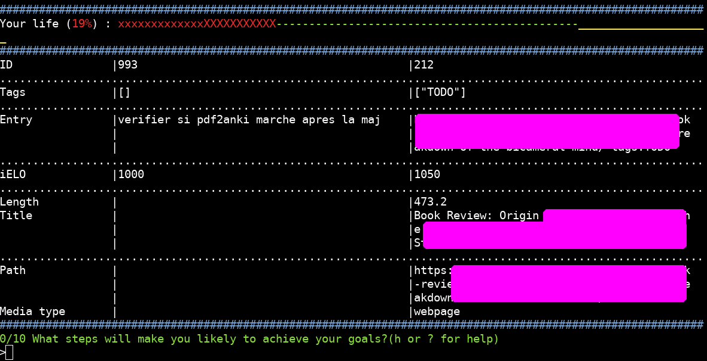

# LiTOY - a List That Outlives You.

Table of contents
-----------------
* [What is LiTOY?](#What-is-LiTOY)
* [Current state](#Current-state)
* [FAQ](#FAQ)
* [Getting started](#Getting-started)
* [Syntax and usage example](#Syntax-and-usage-example)
* [TODO and planned features](#TODO-and-planned-features)
* [Acknowledgements](#Acknowledgements)

What is LiTOY?
==============
There are several ways to look at it:
* LiTOY is a python script using pandas to create and manage a list of your goals. Those goals or objectives (here called "entries") can be short, medium or long term. The idea is to rank them in a smart way using manual pairwise comparisons (here called "reviews") used to assign 2 [ELO scores](https://en.wikipedia.org/wiki/Elo_rating_system) to each goal.
* A way to always follow the `gradient of optimally-spent time`: by using LiTOY you always do what's most important and quick to do, get into the habit of getting `s***` done, don't lose sight of your goals.
* An organizer aiming at centralizing all your goals in a single place while ranking them in an order reflecting optimal execution order.
* In essence, a tool parallel to [Eisenhower Matrices](https://productiveclub.com/eisenhower-matrix/).

The idea behind LiTOY is simple: 
1. put all your goals in a text file (one task by line)
2. have LiTOY import this file into a pandas DataFrame and fetch all relevant metadata (example: length of time to watch a youtube video you linked, average time to read a given webpage)
3. let LiTOY pick 2 items of the database and ask you which is "better". In this case, "better" means either "more important", "more urgent", "quicker", "more fulfilling", "more aligned with my long term goals" etc. Those question are personal and can be edited in the settings.
4. LiTOY will use your answer to assign an importance score (`iELO`) as well as a time score (`tELO`) to each goal. Combining the two scores reflects what is important and fast (`gELO`).
5. You can then know at a glance what's important, what's quick to do, or what's both.

Current state
=============
* This is a personal project that I use daily.
* PRs and issues are extremely appreciated.
* Here's a screenshot:
    

FAQ
===
**What does LiTOY stand for?** It stands for `List that Outlives You`. It is used as a [memento mori](https://en.wikipedia.org/wiki/Memento_mori)

**Where does the idea come from?** From Gwern's [media resorted](https://www.gwern.net/Resorter).

**What should I know if I want to contribute?** The code is as PEP compliant as possible, no docstrings are missing. Type hinting is planned but not done. PRs and issues are extremely welcome, I can be very reactive so don't hesitate to suggest features by opening a github issue, etc.

**Do you accept criticism and/or contribution?** All help and criticisms are very appreciated.

**Do you have any idea it will work or at least converge towards something useful without doing thousands of reviews a day?** Not really, but quick back-of-the-envelope calculation made it look doable. I just do a few tens of reviews almost every day. Making it a habit help not loosing focus on important goals IMO. My habit is doing it when I'm tired of doing anki reviews to remotivate me.

**What are ELO scores? Why did you choose this algorithm?** A ranking system initially devised for chess. The idea is that if you have chess players A, B and C : if `A beats B` and `B beats C` then you don't really have to organize a fight between A and C to know which is better. It does so by assigning a score to each opponent that can then be used to compare opponents that have never met each other. The main selling point of ELO is that it still behaves well even if some players occasionally under perform (or over perform). In the case of LiTOY, you can have some incoherent reviews in your database and it will not throw off the whole ranking. Also, ELO is dead easy to implement and I wanted to completely understand (i.e. grok) my code.

**What platform does it run on?** I tried to make it as agnostic as possible but I'm on Linux and hate other systems. Normally the code should run fine on other systems but please do tell me if you run into an issue.

**What do you call a review and a session?** A review is one single pairwise comparison. Several reviews in a row without changing the reference entry (i.e. the left one) is called a session.

**Why store the db as an excel file?** Because if you run libreoffice you can quickly have a gui to edit the database, whereas handling sqlite or other formats is not as user friendly. There is an option to save the database in json regularly to avoid data loss though. An additional benefit is that the database can easily be indexed in desktop search engine softwares like [Recoll](https://www.lesbonscomptes.com/recoll/).

**How can I undo a review or edit?** It is not really possible for now. But you can access the logs and see what you did wrong. Hopefully this can help you repair damage. Rollback features might be added sometime in the future. If you have any issue feel free to open one, especially if you think your action was not recorded in the log.

**What are answer level number?** If you answer 1 it means you favor the entry on the left compared to the one on the right. 5 means you favor the right one. 3 is obviously the middle ground but is not the same as skipping the fight. Of course, all this is relative to the question that is being considered.

**Any killer features you want to brag about?** LiTOY automatically retrieves lots of metadata from the links. Like reading time from a pdf, a webpage, duration of a video etc. Also, it's mostly in one single file, making it somewhat easier to understand how it works and to maintain.

**Is there a way to ask litoy to fetch metadata for a video that is not on youtube?** Yes, just add somewhere `type:video` in the entry. you can also use `type:local_video` for local files using `ffmpeg`. Don't forget to use quotation marks (`"`) for local files and use `<TAB>` for path autocompletion.

**Do you care to explain all the different fields in the database?** 
* `ID` used for the pandas index as well as the line number in excel. This should in theory never change for a given entry (even if you edit the content of the entry).
* `date` date in unix time in second of the creation of this entry
* `content` the text content of the entry
* `metacontent` all relevant metadata that LiTOY extracted from `content`, for example url, video duration, time to read a pdf, etc
* `tags` user-specified tags of the entry. You can specify them during reviews or when adding the entry (syntax : `my task is to do X tags:something tags:something else`)
* `starred` used to differentiate this entry from the rest
* `iELO`, `tELO` importance ELO score and time ELO score. A high `iELO` means that the task is important. A high `tELO` means that the task is quick to do.
* `DiELO`, `DtELO` D stands for Delta, as in the difference between two quantities. The `DiELO` value of an entry is the difference between its current and previous `iELO`. This is used to know which entry moved the most in its most recent reviews. This information is relevant to approach optimality when picking entries for reviews.
* `gELO` g stands for Global. The global score merges `iELO` and `tELO` in a common metric. This way the user just has to display the `podium` to prioritise tasks.
* `K` the K factor of an entry is a value that starts high and gradually decreases. It decreases after each review. It appears when calculating ELO scores as a multiplicating factor. It is common in chess tournament etc. The idea is that a new entry has a bonus that makes each win or loss more impactful on its ranking to help it find its true rank faster. Entries that have already been reviewed many times will have more inertia.
* `review_time` simply the amount of time spent reviewing this entry
* `n_review` simply the number of times this entry has been reviewed
* `disabled` is 1 if the user decided to disable this entry. It will not appear in the podium or during reviews but will remain in the database. You can use this if you have accomplished the task or if you decide that you won't ever do it.

**What is the podium?** just a way to show the entries with the highest global scores.

**What does it mean to answer 1 vs 2/3/4/5?** 1 means you favor the one on the left, strongly. 5 means you favor the one on the right strongly. 3 means they are equal, 2 and 4 are intermediate score ("I prefer left over right, but not that strongly"). Remember that this will change ELOs for *both* entries at every fight.

**Where can I see the correct syntax to use when writing a file destined for importation?** In [this file](./example_new_entry.txt)

**What is the difference between the entry on the left and on the right?** LiTOY actually picks `n_to_review+1` entries : one is the reference entry on the left and all the others appear on the right. This way it is easier for the mind (i.e. less cognitive fatigue) to do several reviews in a row.

**Can I open the database using libreoffice?** Yes, it's why I chose this format. But close LiTOY first and don't forget to save your changes in libreoffice. Note that the whole database is saves as a json file at each startup too.

**What do you call a review?** It's just a pairwise comparison between two entries. I chose this name because I use [Anki](https://apps.ankiweb.net/) **a lot**.

**What is the progress score?** It's the mean of `the mean and the median` of all the Delta scores, divided by the total number of non disabled entries. The idea is that the mean is too sensitive to extreme values and the median is not enough (it stays at the same value until you did 50% of the reviews). This value is at its lowest when all the reviews have been done and the entries are not moving anymore (i.e. the Delta scores stay low).

**Can you give an example of how to use the python console?** Here's an example showing how to rename a tag:
    * **make a backup first**
    * `litoy -P`
    * `>>> df["content"] = df["content"].str.replace("tags:TODO", "tags:todo")`
    * `>>> df["tags"] = df["tags"].str.replace("TODO", "todo")`
    * `>>> litoy.get_tags(df)  # to check the results`
    * `>>> litoy.save_to_file(df)  # to save`
    * `>>> exit()`

Getting started:
====================
* Read this page thoroughly. Don't be afraid to ask questions.
* make sure you have python 3.8 installed (3.9 with pyenv seems to have issues with importing pandas)
* run the following command into a terminal to install dependencies required by `pdftotext`: "sudo apt-get install build-essential libpoppler-cpp-dev pkg-config python-dev"
* `git clone https://github.com/thiswillbeyourgithub/LiTOY-aka-List-that-Outlives-You && cd LiTOY-aka-List-that-Outlives-You`
* manually edit the settings in the file `user_settings.py`
* install the dependencies using `pip3.8 install -r requirements.txt`
* show the help `python3.8 ./LiTOY.py --help`
* before entering `review mode`, your database will need to contain at least 10 entries. To add them, either use `--import-from-file FILE` or `--add`
*I recommend setting an alias in your shell, mine is `alias litoy = 'cd /litoy/folder && python3.8 ./LiTOY.py --db personnal_database.xlsx'` hence, I just have to type `litoy -a` to add new entries

Syntax and usage example:
-------------------------
*I recommend python 3.8 instead of 3.9 because some users using pyenv can run into weird issues with pandas.*

`python3.8 LiTOY.py --db database.xlsx --add`
    * Add new entries

`python3.8 LiTOY.py --db database.xlsx --edit_entries ID ID ID`
    * Edit entries with corresponding IDs

`python3.8 LiTOY.py --db database.xlsx --review
    * Begin `n_session` sessions where LiTOY automatically picks `n_to_review` entries and review them (it's actually twice the amount of reviews that you have to do because you have 2 questions each time).

`python3.8 LiTOY.py --db database.xlsx --import-from-file file.txt`
    * Automatically import from the file. Each line becomes an entry. Except if it is already part of the database. Lines beginning with `#` are ignored. Metadata will be automatically retrieved so be patient.
    * To see example of the syntax for the import file, read [this file](./example_new_entry.txt)

`python3.8 LiTOY.py --help`
    * Display full usage

TODO and planned features:
======
* always move tags at the end of the entry
* implement a two letter shortcut code to answer importance and time at the same time
* implement an undo function : simple : just save the dictionnary of each pair during the last few reviews and roll them back one by one : implement a new method to do a rollback, and save each former dataframe in the litoy class
* use strong type hints
* make it into a pip package on PyPI
* answer to this guy https://www.lesswrong.com/posts/54Bw7Yxouzdg5KxsF/how-do-you-organise-your-reading
* when stable: talk about it on psionica, then lesswrong

Acknowledgements
===============
In no particular order:
* Thanks to Emile Emery for his help in determining the best sorting algorithm to use and implementing it.
* Thanks to [Kryzar (Antoine Leudière)](https://github.com/kryzar) for his insight on UI as well as evaluating the quality of the code and more.
